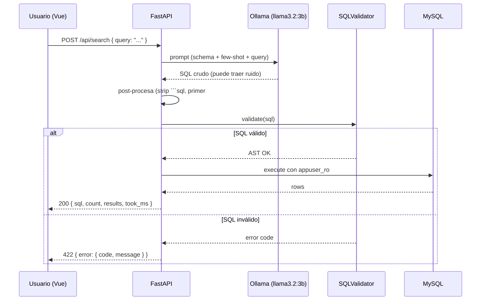

# /sync-api-docs · proyecto-propiedades

Mantiene `backend-developer/` (Docusaurus 3 + Scalar) en sync con el backend `backend/`. Hereda el patrón del comando `/sync-website` del monorepo, recortado.

> **Trigger natural:** después de implementar/cambiar un endpoint, o antes de grabar la demo.

---

## Misión

1. Importar la spec OpenAPI viva del backend (no la deployada en QA, sino la del repo local).
2. Refrescar `static/openapi.json`.
3. Revisar/actualizar páginas estáticas (`docs/intro.md`, `docs/flows/search-flow.md`, `docs/architecture/*`).
4. Verificar que el sitio compila (`pnpm build`) y se sirve.
5. Commit a `backend-developer`.
6. Anotar en `assessments/CHANGELOG.md`.

---

## Procedimiento

### Paso 1 — Pre-flight
```bash
# Backend corriendo (uvicorn local o docker)
curl -fsS http://localhost:8000/openapi.json > /tmp/openapi.json
test -s /tmp/openapi.json || { echo "❌ openapi.json vacío — backend no responde"; exit 1; }

# Docs project listo
cd backend-developer
test -f scripts/fetch-openapi.mjs || { echo "❌ falta script fetch-openapi"; exit 1; }
```

### Paso 2 — Sync de la spec
```bash
OPENAPI_URL=http://localhost:8000/openapi.json pnpm fetch-openapi
# El script copia a static/openapi.json + inyecta servers + valida JSON
git diff --stat static/openapi.json
```

### Paso 3 — Auditar páginas estáticas vs spec viva

Páginas que pueden quedar desfasadas:

| Página | Qué verificar | Cómo |
|---|---|---|
| `docs/intro.md` | Versión, descripción del producto | leer + comparar con `info.description` de la spec |
| `docs/flows/search-flow.md` | El diagrama Mermaid del flujo de search refleja el endpoint actual | comparar contra `app/routes.py` |
| `docs/architecture/error-codes.md` | Los códigos de error documentados == catálogo actual | grep `error.code` en `app/exceptions.py` y comparar |
| `docs/reference/health.md` | Shape del health response | `curl /api/health` |
| `sidebars.ts` | Las páginas existen en disco | `test -f docs/<file>.md` por entrada |

Patrón de auditoría rápido:
```bash
# Códigos de error en código vs en docs
grep -rn 'code: \?"\(LLM_\|SQL_\|EMPTY_\|DB_\)' ../backend/app/ | sort -u > /tmp/codes_code.txt
grep -rn '`\(LLM_\|SQL_\|EMPTY_\|DB_\)' docs/ | sort -u > /tmp/codes_docs.txt
diff /tmp/codes_code.txt /tmp/codes_docs.txt
```

Si hay diferencia, **fix las páginas**, no el código (la spec es source of truth).

### Paso 4 — Build local
```bash
pnpm typecheck
pnpm build
# Debe terminar sin warnings de "broken link" (config.onBrokenLinks: 'throw')
```

### Paso 5 — Preview
```bash
pnpm serve   # http://localhost:3001
# Verificar manualmente:
#   - /api-docs muestra Scalar con POST /api/search desplegable
#   - sidebars cargan
#   - flow diagrams renderizan
```

### Paso 6 — Commit
```bash
git add static/openapi.json docs/ sidebars.ts
git commit -m "docs: sync API reference + flows from backend"
git push origin main
```

### Paso 7 — Update CHANGELOG
En `assessments/CHANGELOG.md`:
```markdown
### YYYY-MM-DD — Docs sync
- OpenAPI: hash X → hash Y
- Páginas actualizadas: <lista>
- Build: verde
```

---

## Páginas que el comando crea/actualiza por defecto

Si alguna no existe, **créala** con esqueleto:

### `docs/intro.md`
```md
---
sidebar_position: 1
---
# proyecto-propiedades API

API REST para búsqueda de propiedades inmobiliarias usando lenguaje natural.

## Stack
- FastAPI 0.115+ · Python 3.12
- MySQL 8.0 con SQLAlchemy 2 async
- Ollama (`llama3.2:3b`) para NL→SQL

## Quick start
\`\`\`bash
curl -X POST http://localhost:8000/api/search \\
  -H 'Content-Type: application/json' \\
  -d '{"query":"Busco casas de 3 habitaciones en zona 10"}'
\`\`\`

Ver [API Reference](/api-docs) para detalles.
```

### `docs/flows/search-flow.md`
```md
---
sidebar_position: 1
---
# Flujo: Búsqueda de propiedades



## Defensa en profundidad

1. Sanitización del NL.
2. Prompt con reglas estrictas + temperatura 0.0.
3. Post-procesado del output del LLM.
4. `sqlglot` parsea + AST whitelist.
5. Usuario MySQL `appuser_ro` con sólo `SELECT`.
```

### `docs/architecture/error-codes.md`
```md
# Catálogo de errores

| HTTP | code | Cuándo |
|---|---|---|
| 400 | EMPTY_QUERY | query vacía o > 500 chars |
| 422 | LLM_TIMEOUT | Ollama tardó > 15s |
| 422 | LLM_INVALID_OUTPUT | LLM no devolvió SQL parseable |
| 422 | SQL_NOT_SELECT | SQL generado no es un SELECT puro |
| 422 | SQL_FORBIDDEN_TABLE | Tabla distinta a `propiedades` |
| 422 | SQL_DANGEROUS_FUNCTION | SLEEP/BENCHMARK/LOAD_FILE/INTO OUTFILE |
| 500 | DB_ERROR | Falla en MySQL |
| 503 | LLM_UNAVAILABLE | Ollama no responde |

Envelope estándar:
\`\`\`json
{ "error": { "code": "LLM_TIMEOUT", "message": "Tiempo de espera del LLM excedido", "detail": null } }
\`\`\`
```

---

## Checklist final

- [ ] `static/openapi.json` actualizado y commiteado
- [ ] `pnpm build` verde
- [ ] Códigos de error en docs == código (`grep` diff vacío)
- [ ] `/api-docs` (Scalar) muestra `POST /api/search` con request/response examples
- [ ] CHANGELOG actualizado con sync entry
