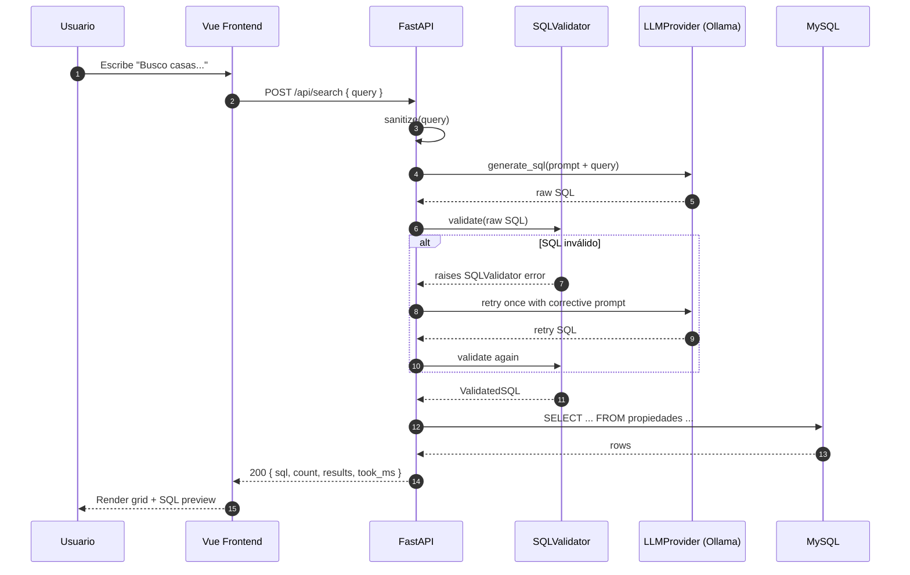

# Flujo de `POST /api/search`

## Pasos en detalle

### 1. Sanitización del input
- `query.strip()` y `len ≤ 500`
- Rechazo de caracteres de control (`\x00-\x1f` excepto `\n`)
- Si falla → HTTP 422 `EMPTY_QUERY`

### 2. Generación SQL con LLM
- Prompt versionado (`PROMPT_VERSION="v1"`) con esquema + 6 few-shot
- Temperatura 0.0 para reproducibilidad
- Timeout 15s (`OLLAMA_TIMEOUT_SECONDS`)
- Post-procesado: strip markdown backticks, primera sentencia hasta `;`

### 3. Validación SQL (defensa anti-injection)
**Triple capa:**
1. **`sqlglot` parser** → AST estructural. Si falla → `LLM_INVALID_OUTPUT`
2. **AST whitelist:**
   - Exactamente UN `Select` (multi-statement → `SQL_FORBIDDEN_STATEMENT`)
   - Tabla única `propiedades` (otras → `SQL_FORBIDDEN_TABLE`)
   - Sin DML/DDL → `SQL_NOT_SELECT`
   - Sin funciones peligrosas (SLEEP/BENCHMARK/LOAD_FILE/INTO OUTFILE) → `SQL_DANGEROUS_FUNCTION`
   - Clamp `LIMIT` a max 200
3. **MySQL transport (opcional):** usuario `appuser_ro` con sólo `GRANT SELECT`

### 4. Retry correctivo (1×)
Si la validación falla, se reintenta UNA vez con prompt que incluye el motivo del error. Si el retry también falla, se propaga el error original.

### 5. Ejecución en MySQL
- `text(validated_sql.sql)` vía SQLAlchemy `AsyncSession`
- Mapeo `_mapping` → `PropertyRow` → `PropertyOut`
- Errores `OperationalError` → HTTP 500 `DB_ERROR`

### 6. Respuesta
`SearchResponse { query, sql, count, results, took_ms }` con `X-Request-ID` header.
